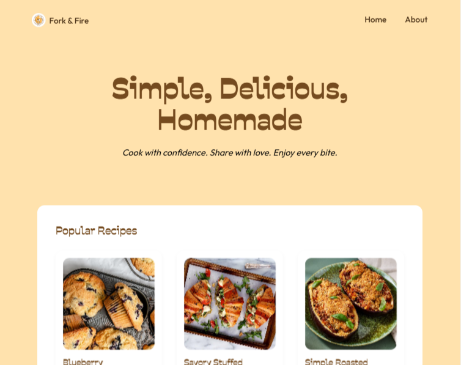
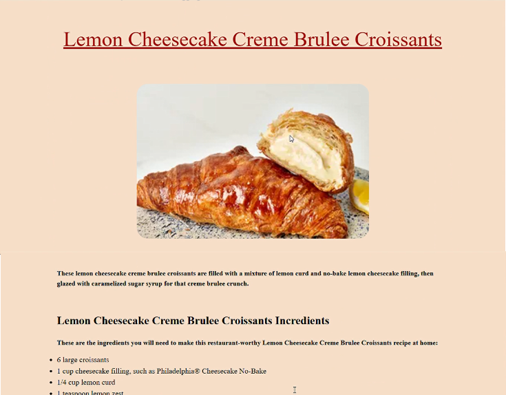
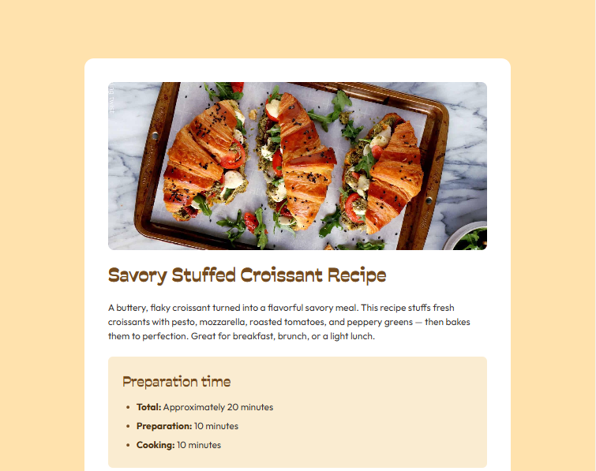

# 🍽️ Odin Recipes

A simple, clean multi-page recipe website built as part of [The Odin Project](https://www.theodinproject.com) curriculum.  
Originally started with basic HTML and CSS, this project was later redesigned with a modern UI and enhanced using JavaScript for dynamic recipe rendering.

## 📅 Project Timeline

- **First Created:** August 26, 2024  
- **Redesigned:** June 19, 2025  
  > 🎨 Recipe page redesign inspired by a challenge from [Recipe page challenge on Frontend Mentor](https://www.frontendmentor.io/challenges/recipe-page-KiTsR8QQKm)

## 🔗 Live Site

- 🌐 [Live Website](https://muhamedrazik-2003.github.io/odin-recipes/)
- 📂 [GitHub Repository](https://github.com/muhamedrazik-2003/odin-recipes)

## 📖 Project Overview

This project began as a basic static HTML site featuring a homepage and three individual recipe pages.  
After 10 months, it was completely redesigned:

- ✅ New modern layout
- ✅ Recipe cards with images on the homepage
- ✅ JavaScript used to inject recipe content dynamically
- ✅ Uses URL parameters to identify which recipe to display
- ✅ Clean DOM manipulation using `querySelector`

## 🛠️ Built With

- HTML5
- CSS3
- JavaScript (ES6+)

## 📂 Project Structure
odin-recipes/
├── index.html # Homepage with recipe cards
├── recipe.html # Single page to show any recipe
├── recipe.js # JS to dynamically load recipe data
├── index.css # Main stylesheet
├── recipe.css # recipe.html and about.html stylesheet
├── images/recipes # All recipe images
└── images/about # Screenshots of old and new website

---

## 🧠 Key Concepts Learned

- Structuring multi-page static websites
- Using semantic HTML and clean CSS
- Dynamically injecting data with JavaScript
- Passing and reading URL parameters
- DOM manipulation using `querySelector` and dataset attributes

## 📸 Screenshots

| Old Version | New Version |
|-------------|-------------|
|  |  |
|  |  |

## 🚀 Future Improvements

- Make the site fully responsive
- Store recipe data in a separate JSON file
- Add search/filter functionality
- Allow users to favorite recipes
- Improve accessibility and contrast

---

## 👨‍🍳 Author

**Muhamed Razik**  
Created on August 26, 2024 • Redesigned on June 19, 2025  
Inspired by [The Odin Project](https://www.theodinproject.com) and [Frontend Mentor](https://www.frontendmentor.io)

---

